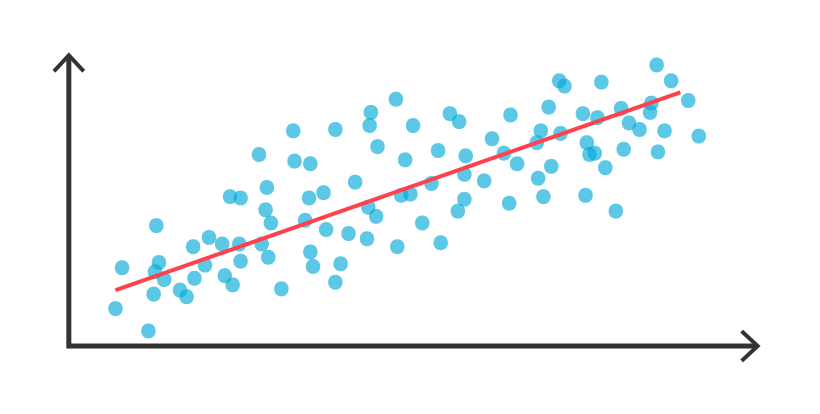

--- 
title: 'w203: Statistics for Data Science'
author: "w203 Instructors"
date: "`r Sys.Date()`"
documentclass: book
bibliography:
- book.bib
- packages.bib
biblio-style: apalike
link-citations: yes
colorlinks: yes
description: |
  w203 course notes
github-repo: mids-w203/notes
site: bookdown::bookdown_site
---
\newcommand{\E}[1]{{\mathbb{E}\left[ #1 \right]}}
\newcommand{\V}[1]{{\mathbb{V}\left[ #1 \right]}}
\renewcommand{\C}[1]{{\text{Cov}\left[ #1 \right]}}
\renewcommand{\v}[1]{{\boldsymbol{#1}}}
\newcommand{\m}[1]{{\mathbb{#1}}}
\newcommand{\p}[1]{{\mathbb{P}\left(#1\right)}}
\newcommand{\eps}{\varepsilon}


# Cover {-}
```{r echo=FALSE, out.width="85%"}

```


